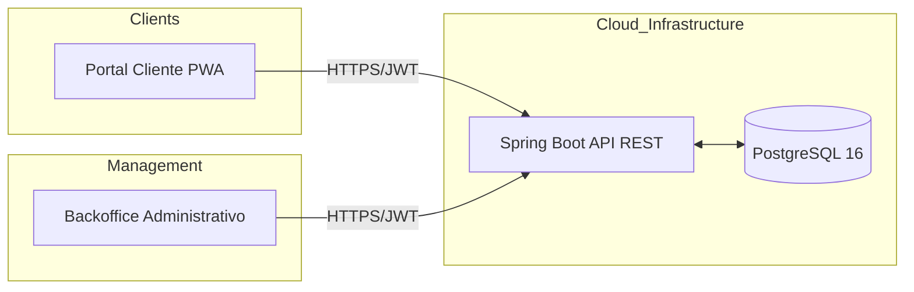

# 🛠️ ReparaSuite: Enterprise Service Management Ecosystem

ReparaSuite es una solución SaaS de alto rendimiento diseñada para la gestión integral del ciclo de vida de servicios técnicos. A diferencia de sistemas simples, este ecosistema utiliza una arquitectura de Backend Único y Frontend Multicliente, optimizando la experiencia operativa para técnicos y la experiencia de usuario para clientes finales.

## 🏗️ Arquitectura de Software

El sistema implementa un modelo de comunicación desacoplado:

* **Core Engine (API):** `Spring Boot 3` + `Java 21` con persistencia en `PostgreSQL`.
* **Admin Dashboard:** Aplicación de alta densidad construida en `Angular 19` + `Material Design`.
* **Customer Portal:** `PWA` (Progressive Web App) ligera para seguimiento en tiempo real.

## 🚀 Tecnologías y Stack Profesional

* **Backend:** Java 21, Spring Boot 3, Spring Security (JWT), Hibernate/JPA.
* **Frontend:** Angular 19, RxJS (Gestión de estados), Angular Material, Service Workers (PWA).
* **DevOps & Infraestructura:** Docker, Docker Compose, Nginx, GitHub Submodules.
* **Metodología:** AI-Driven Development con Google Gemini.

## 📦 Gestión de Infraestructura

El proyecto utiliza un enfoque de Infraestructura como Código (IaC) mediante Docker, permitiendo un despliegue idéntico en desarrollo, testing y producción.

# Clonar el ecosistema completo (incluyendo submódulos)
git clone --recurse-submodules [https://github.com/GledysP/reparasuite-root.git](https://github.com/GledysP/reparasuite-root.git)

# Despliegue de servicios (DB + API + 2 Frontends)
docker-compose up --build -d

## 🧠 AI-Driven Development (Desarrollo Asistido por IA)
La construcción de ReparaSuite utiliza metodologías modernas de desarrollo impulsado por Inteligencia Artificial. Se ha logrado:

* **Clean Code & Refactorización:** Mantenimiento estricto del principio DRY (Don't Repeat Yourself) y refactorización masiva de estilos a sistemas globales.

* **UI/UX Pixel Perfect:** Estandarización de componentes de Angular Material mediante la manipulación de variables internas (MDC Tokens) sugeridas y auditadas por IA.

* **Resolución de Problemas Complejos:** Aceleración en la configuración de infraestructuras (Docker, Git Submodules) y arquitecturas de software.